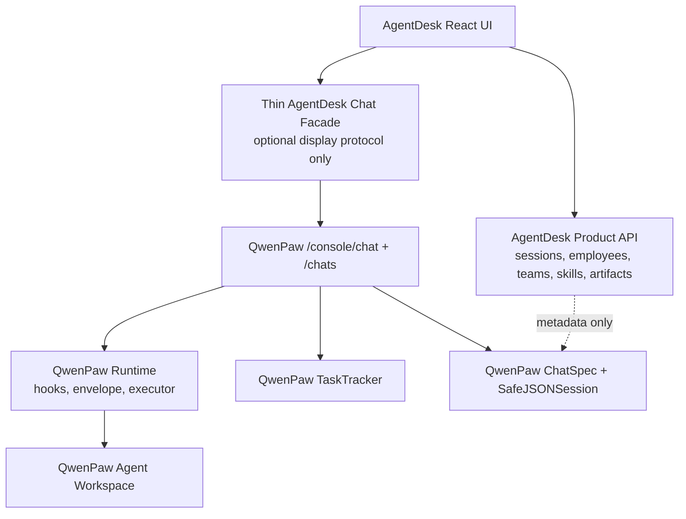

# AgentDesk2 Replatform on QwenPaw Main

Date: 2026-06-29

Status: Proposed

Branch/worktree:

- Current AgentDesk branch: `codex/dev-review-fixes` in `D:\proj\agentDesk2`
- Replatform branch: `codex/replatform-on-qwenpaw-main`
- Replatform worktree: `D:\proj\agentDesk2-replatform-main`
- Baseline: `qwenpaw-upstream/main` at `90e508e` (`v2.0.0-beta.1`)

## Context

AgentDesk2 started from QwenPaw `dev/agentscope2.0` at `c74d5ea`, then added a WorkBuddy-like frontend and a AgentDesk backend adaptation layer. That adaptation layer now owns too much chat/runtime behavior:

- AgentDesk task store persists canonical-looking messages.
- AgentDesk chat APIs translate QwenPaw console SSE into AgentDesk-specific SSE.
- AgentDesk task/session/run status duplicates QwenPaw `ChatSpec`, `SafeJSONSession`, `Runtime`, and `TaskTracker` state.
- Team/single routing is patched around persisted task metadata.
- Skill mounting reloads agents inside the chat path.
- Workspace file access and config APIs have security issues that come from AgentDesk owning low-level runtime concerns.

Meanwhile upstream QwenPaw `main` has evolved materially beyond our base:

- AgentScope upgraded to `2.0.2`.
- Console chat uses `ChatSpec.id` as the run key.
- `TaskTracker` supports background runs, reconnect, stop, multi-subscriber streaming, and active run status.
- `Runtime` has lifecycle phases, hooks, envelope emission, and per-request context.
- Request context already carries `session_id`, `agent_id`, `root_session_id`, and `root_agent_id`.
- Upstream added AS2 memory/session improvements, sandboxing, governance/ToolGuard, context compression, provider/skill changes, and streaming fixes.

So the core problem is not only individual bugs. The architecture has drifted: AgentDesk duplicates QwenPaw runtime truth instead of presenting a product layer over it.

## Decision

Replatform AgentDesk2 on top of QwenPaw upstream `main`.

Do not merge upstream `main` into the current thick AgentDesk adaptation branch as the primary path. Instead:

1. Treat QwenPaw `main` as the platform baseline.
2. Reattach AgentDesk product semantics as a thin layer.
3. Move AgentDesk frontend/product APIs gradually.
4. Avoid carrying over AgentDesk's custom canonical chat runtime.

This is a replatform, not a normal merge.

## Product Model

AgentDesk is a local agent workbench, not a QwenPaw Console skin and not a separate runtime.

### Session

`Session` is the user-visible conversation/task room and the shared context container.

In AgentDesk UI this may still be called a task in some places during migration, but semantically `task_id` should become an alias for `session_id`, not a separate runtime identity.

Required fields:

- `session_id`
- `title`
- `mode`: `single` or `team`
- `created_at`
- `updated_at`
- optional product metadata: pinned, workspace summary, last actor, labels

### Run

`Run` is one execution turn inside a session.

Required fields:

- `run_id`
- `session_id`
- `agent_id`
- `skill_names`
- `model`
- `workspace_dir`
- `status`: idle/running/completed/failed/cancelled
- `started_at`
- `finished_at`

In upstream QwenPaw today, `ChatSpec.id` is the active run key for `TaskTracker`. AgentDesk should either reuse that directly or add a very thin `AgentDeskRun` metadata table that points to the upstream chat/run key.

### Message

Messages belong to a session. Assistant/tool messages must be attributable to a run and agent.

Required fields or derived metadata:

- `session_id`
- `role`
- `content`
- `run_id`
- `agent_id`
- `created_at`
- optional display metadata: sender name, avatar, skill badges

Canonical message content should come from QwenPaw session/memory where possible. AgentDesk may keep display indexes/caches, but should not maintain a second authoritative message history.

### Artifact

Artifacts belong to a session and are produced by a run/agent.

Required fields:

- `artifact_id`
- `session_id`
- `run_id`
- `agent_id`
- `path`
- `type`
- `created_at`

Artifact and file APIs must enforce a workspace root. No arbitrary absolute path preview.

## UX Semantics

### Single Chat Mode

Expected experience:

- Opening a session starts with the default AgentDesk agent.
- The user can switch to another agent for a later turn in the same session.
- The user can mount skills for a later turn in the same session.
- All selected agents share the same session context.
- Each assistant response clearly shows which agent produced it.

Architecture implication:

- `session_id` remains stable.
- Each turn creates a new `run_id`.
- Each run binds `agent_id` and `skill_names`.
- Agent switching is a run-level change, not a session replacement.

Open validation needed:

- Confirm upstream QwenPaw `SafeJSONSession` and agent memory can safely share the same `session_id` across different `agent_id` values without isolating state per agent workspace.
- If upstream stores session state per agent workspace, we should add a AgentDesk session bridge/hook at the runtime boundary rather than reintroduce AgentDesk's custom message store.

### Team Mode

Expected experience:

- A team session is fixed to a team orchestration.
- The user cannot switch that session to arbitrary single-agent chat.
- If the user tries to switch agent, the UI should prompt them to open a new single chat session.

Architecture implication:

- `mode=team` is immutable after the first team run.
- Team leader/member routing is orchestration metadata, not normal single-agent switching.
- Team member sub-conversations should be modeled as child runs or child sessions with `root_session_id` pointing to the visible team session.

## Keep, Rewrite, Delete

### Keep or Transplant

These are product-layer assets and should be moved onto the new baseline:

- React AgentDesk shell and visual language.
- Employee/plaza/team/skill product concepts.
- Built-in employee catalog and avatar helpers.
- Skill discovery/mounting UI.
- Team timeline UI utilities, after normalizing them around `root_session_id`/run metadata.
- Product metadata APIs where they do not duplicate QwenPaw runtime state.
- Docs and AgentDesk-specific tests that describe product behavior.

### Rewrite or Thin

These areas should be rewritten against upstream `main` instead of merged as-is:

- `src/qwenpaw/agentdesk/chat.py`: currently owns too much runtime, stream translation, task message persistence, reconnect, skill mount, model prep, and team/single routing.
- `src/qwenpaw/agentdesk/team_chat.py`: should be rebuilt around upstream multi-agent/root-session concepts.
- `task_store` message persistence: should become product metadata/indexing, not canonical chat storage.
- AgentDesk SSE protocol: either use upstream console SSE directly in the frontend or keep a very thin display adapter that does not persist canonical messages.
- `runStatus`: should derive from upstream `TaskTracker`/run metadata.
- Skill mounting during chat: should become explicit run preparation and produce run metadata.
- Workspace file preview/artifact browsing: should use a bounded artifact/workspace service.
- Agent profile provisioning: should use upstream agent/profile APIs where possible and avoid direct config mutation inside hot chat paths.

### Delete or Deprecate

Likely deletion candidates after migration:

- Legacy unused `pages/Chat` path if the router no longer reaches it.
- Old static frontend mount behavior that builds frontend assets at backend startup.
- Custom AgentDesk canonical message history if upstream session history is sufficient.
- Any API returning raw provider keys or accepting arbitrary workspace paths.
- Compatibility shims that exist only for the old `dev/agentscope2.0` branch.

## Target Integration Shape



AgentDesk owns:

- Product navigation
- Employee/team/skill catalog
- Session metadata
- Artifact index
- Display attribution

QwenPaw owns:

- Agent execution
- Streaming envelopes
- Tool calls
- Memory/session state
- Approvals/security/governance
- Provider/model/runtime lifecycle

## Migration Milestones

### M0: Freeze the Decision

Deliverables:

- This decision document.
- Replatform worktree based on `qwenpaw-upstream/main`.
- No product code moved yet.

### M1: Boot AgentDesk Mode on QwenPaw Main

Goal:

- Add the minimum AgentDesk route/frontend mount on the replatform branch.
- No custom chat runtime yet.
- Backend startup must not run `npm build`.

Acceptance:

- QwenPaw main still starts and tests pass.
- AgentDesk frontend can be served as a product shell.

### M2: Product Metadata APIs

Goal:

- Port employees, teams, skills, and session metadata APIs.
- Keep them separate from QwenPaw runtime state.

Acceptance:

- Employee/team/skill screens load.
- No chat stream is ported yet.
- No raw API keys are returned.
- No arbitrary absolute workspace path is accepted.

### M3: Single Session / Multi-Agent Run Prototype

Goal:

- Implement single-chat session where agent switching is per run.
- Use stable `session_id`.
- Use upstream `console/chat`, `ChatSpec`, `TaskTracker`, and runtime as much as possible.

Acceptance:

- Session starts with default AgentDesk agent.
- User can send turn 1 to agent A and turn 2 to agent B in the same session.
- Both turns render in the same AgentDesk conversation.
- Assistant messages show `agent_id`.
- Stop/reconnect use upstream tracker behavior.

### M4: Skills as Run Prep

Goal:

- Mount/enable skills before a run and record `skill_names` in run metadata.

Acceptance:

- Skill badges display per assistant turn.
- Agent reload is explicit and bounded.
- Skill mount failures fail the run cleanly without corrupting session state.

### M5: Artifacts and Workspace Safety

Goal:

- Replace file preview with bounded artifact/workspace service.

Acceptance:

- Artifact paths must resolve under an approved workspace/artifact root.
- Absolute path traversal is rejected.
- Artifact cards link to run/agent metadata.

### M6: Team Mode

Goal:

- Rebuild team orchestration on top of root session/run metadata.

Acceptance:

- Team sessions cannot switch to arbitrary single agent.
- Child member activity points to `root_session_id`.
- Team timeline is derived from run/tool metadata, not brittle string parsing.

## Risks and Unknowns

1. Upstream session isolation is per runner/session directory today. Same
   `session_id` with different agent workspaces does not automatically share
   context. AgentDesk needs a session-history bridge or shared session directory
   policy for single-chat multi-agent continuity.
2. Upstream `ChatSpec.id` currently maps one session to one chat id. AgentDesk may need a run metadata layer if multiple concurrent runs in one session become necessary.
3. AgentDesk frontend currently expects a custom SSE shape. Either the frontend must learn upstream envelope events, or we need a thin stateless adapter.
4. Team timeline code currently relies on legacy session suffixes and tool-name parsing. It should be migrated after single mode is stable.
5. Moving too much old `agentdesk/chat.py` into main will recreate the same thick adapter. The migration should bias toward deleting old runtime code.

## Parallel Workstreams

Useful Codex roles once we start implementation:

- Runtime explorer: verify upstream same-session multi-agent behavior and document exact hook/API points.
- Frontend porter: mount AgentDesk React shell on QwenPaw main with no chat runtime.
- Product API worker: port employees/plaza/skills metadata APIs and tests.
- Security worker: fix current branch path traversal/API-key leaks in parallel if we keep using it during migration.
- Reviewer: review every migration milestone against the rule "QwenPaw owns runtime truth."

## Near-Term Recommendation

Start with M1 and the runtime explorer in parallel.

The most important technical question is whether upstream main can support:

```text
same session_id
turn 1: agent_id = default
turn 2: agent_id = emp_researcher
shared visible context
distinct run/agent attribution
```

If yes, AgentDesk's chat layer can become very thin.

If no, we should add the missing bridge at the QwenPaw runtime/session boundary, not preserve AgentDesk's current duplicate message runtime.

## Current-Branch Security Hardening

While the replatform branch is the target architecture, the current
`codex/dev-review-fixes` branch still needs to be safe enough to run during
migration. The first local hardening slice addresses the highest-risk AgentDesk
BFF boundaries:

- settings responses no longer return raw provider API keys to the browser;
- `POST /api/tasks` rejects client-controlled `workspace_dir`;
- task workspace file preview rejects absolute, drive-relative, and rooted
  paths, then resolves only inside server-derived agent/team workspace roots;
- workspace tree listing and basename file lookup ignore symlink escapes outside
  approved workspace roots;
- task deletion no longer removes arbitrary roots based on
  `task_id in path_str`; it only removes AgentDesk-owned
  `agentdesk/task-workspaces/{task_id}` directories.

Verification:

- `uv run --no-sync pytest tests\unit\agentdesk -q` passed
  `36 passed, 2 skipped, 3 warnings`;
- `uv run --no-sync pytest tests\unit\agentdesk\test_agentdesk_security_boundaries.py -q`
  passed `9 passed, 2 skipped, 1 warning`;
- `npm run build` in `src/qwenpaw/agentdesk/web` passed;
- `python -m py_compile src\qwenpaw\agentdesk\router.py tests\unit\agentdesk\test_agentdesk_security_boundaries.py`
  passed after the symlink and rooted-path hardening.

## Current-Branch Session Routing Contract

The current branch now enforces the UX rule we want to carry into the thin
QwenPaw-main replatform:

- a single-chat session may continue with a different employee/agent and may
  mount skills for later turns;
- an established single-chat session may not be converted into team mode; the
  user should open a new session for team chat;
- an established team-chat session may only continue with the same team; it may
  not silently downgrade to a single-agent chat or switch to a different team.

This is intentionally a backend contract, not just a frontend convention. The
old behavior silently coerced stray payloads back to the persisted mode. That
avoided some cross-thread bugs, but it hid the product boundary from users and
made future frontend/runtime refactors ambiguous.

Verification:

- `uv run --no-sync pytest tests\unit\agentdesk\test_agentdesk_session_routing.py -q`
  passed `4 passed`;
- `uv run --no-sync pytest tests\unit\agentdesk -q` passed
  `40 passed, 2 skipped, 3 warnings`.

## Current-Branch Run Status Adapter

The current branch now isolates AgentDesk's `runStatus` projection behind
`qwenpaw.agentdesk.run_status`.

This is a step toward the target architecture, not the final runtime model:

- QwenPaw `TaskTracker` remains the live execution authority;
- AgentDesk `runStatus` is treated as product/display metadata for sidebar,
  reconnect, and stop affordances during migration;
- single-chat, team-chat, and stop APIs now share one adapter for status writes;
- stale scheduled writes are guarded in the adapter, so an old `running` write
  cannot overwrite a later terminal status.

The compatibility aliases in `chat.py` can be removed once the remaining team
chat helpers are split out of the monolithic chat bridge.

Verification:

- `uv run --no-sync pytest tests\unit\agentdesk\test_agentdesk_run_status.py tests\unit\agentdesk\test_agentdesk_session_routing.py -q`
  passed `7 passed`;
- `uv run --no-sync pytest tests\unit\agentdesk -q` passed
  `43 passed, 2 skipped, 3 warnings`;
- `python -m py_compile src\qwenpaw\agentdesk\run_status.py src\qwenpaw\agentdesk\chat.py src\qwenpaw\agentdesk\team_chat.py src\qwenpaw\agentdesk\router.py tests\unit\agentdesk\test_agentdesk_run_status.py`
  passed.

## Current-Branch Message Projection

The current branch now isolates browser-facing message projection in
`qwenpaw.agentdesk.message_projection`.

This does not yet remove AgentDesk's display message cache. It does make the next
step clearer:

- `TaskStore` still owns the temporary AgentDesk message cache and streaming
  write pointers;
- user-message display cleanup and assistant sender projection live outside
  `TaskStore`;
- future migration can replace the cache source with QwenPaw session history
  while preserving a small AgentDesk projection layer for browser shape,
  artifacts, and team tabs.

Verification:

- `uv run --no-sync pytest tests\unit\agentdesk\test_agentdesk_message_projection.py tests\unit\agentdesk\test_agentdesk_run_status.py -q`
  passed `6 passed`;
- `uv run --no-sync pytest tests\unit\agentdesk -q` passed
  `46 passed, 2 skipped, 3 warnings`;
- `python -m py_compile src\qwenpaw\agentdesk\message_projection.py src\qwenpaw\agentdesk\task_store.py tests\unit\agentdesk\test_agentdesk_message_projection.py`
  passed.

## Current-Branch Session Identity Consolidation

The AgentDesk session identity constants now live at the session boundary:
`qwenpaw.agentdesk.session_bridge.AGENTDESK_SESSION_USER_ID` and
`AGENTDESK_SESSION_CHANNEL`.

`chat.py`, `session_history.py`, `automation.py`, and `task_cleanup.py` now
derive their AgentDesk QwenPaw session key from that single source. This keeps
runtime writes, display-history reads, scheduled dispatch, and cleanup aligned
on the same `{session_id, user_id, channel}` contract.

Verification:

- `uv run --no-sync pytest tests\unit\agentdesk\test_agentdesk_session_history.py tests\unit\agentdesk\test_agentdesk_session_bridge.py tests\unit\agentdesk\test_agentdesk_security_boundaries.py -q`
  passed `17 passed, 2 skipped, 1 warning`;
- `uv run --no-sync pytest tests\unit\agentdesk -q` passed
  `59 passed, 2 skipped, 3 warnings`;
- `python -m py_compile src\qwenpaw\agentdesk\session_bridge.py src\qwenpaw\agentdesk\session_history.py src\qwenpaw\agentdesk\chat.py src\qwenpaw\agentdesk\automation.py src\qwenpaw\agentdesk\task_cleanup.py tests\unit\agentdesk\test_agentdesk_session_history.py`
  passed.

## Current-Branch Router Message Projection Alignment

Task list/detail payloads now use the same projection module as live chat and
session-history fallback:
`qwenpaw.agentdesk.message_projection.messages_for_client`.

`qwenpaw.agentdesk.user_message_display` is reduced to the lower-level rule for
turning stored user text into user-visible text. API task serialization no
longer has its own message-list sanitizer, so `/api/tasks`, live stream `done`
payloads, member-tab reads, and session-history fallback now share one display
projection path.

Verification:

- `uv run --no-sync pytest tests\unit\agentdesk\test_agentdesk_message_projection.py tests\unit\agentdesk\test_agentdesk_security_boundaries.py -q`
  passed `14 passed, 2 skipped, 1 warning`;
- `uv run --no-sync pytest tests\unit\agentdesk -q` passed
  `60 passed, 2 skipped, 3 warnings`;
- `python -m py_compile src\qwenpaw\agentdesk\router.py src\qwenpaw\agentdesk\message_projection.py src\qwenpaw\agentdesk\user_message_display.py tests\unit\agentdesk\test_agentdesk_message_projection.py tests\unit\agentdesk\test_agentdesk_security_boundaries.py`
  passed.

## Current-Branch Session History Upstream Conversion

The AgentDesk session-history fallback now reads shared QwenPaw session state
through the same canonical conversion path used by QwenPaw's `/chats/{id}`
history API:

- parse `agent.state` with `agentscope.state.AgentState`;
- convert AgentScope `Msg` values with
  `qwenpaw.app.runner.utils.agentscope_msg_to_message`;
- support legacy `agent.memory` through
  `qwenpaw.app.runner.utils.parse_legacy_memory_state`;
- only then project runtime `Message` values into AgentDesk's UI message shape.

A raw-context fallback remains for partially malformed historical files, but it
is now explicitly the fallback rather than AgentDesk's primary history reader.
This reduces drift between AgentDesk task-display recovery and QwenPaw's native
chat history model.

Verification:

- `uv run --no-sync pytest tests\unit\agentdesk\test_agentdesk_session_history.py tests\unit\agentdesk\test_agentdesk_message_projection.py tests\unit\agentdesk\test_agentdesk_security_boundaries.py -q`
  passed `20 passed, 2 skipped, 1 warning`;
- `uv run --no-sync pytest tests\unit\agentdesk -q` passed
  `61 passed, 2 skipped, 3 warnings`;
- `python -m py_compile src\qwenpaw\agentdesk\session_history.py tests\unit\agentdesk\test_agentdesk_session_history.py`
  passed.

## Current-Branch Runner Session-State Helper

The QwenPaw runner layer now exposes
`qwenpaw.app.runner.utils.session_state_to_messages`.

This helper owns the canonical saved-session-to-runtime-message conversion:

- parse `agent.state.context` through `AgentState`;
- fall back to legacy `agent.memory`;
- convert AgentScope `Msg` values through `agentscope_msg_to_message`.

Both QwenPaw's native `/chats/{id}` API and AgentDesk's shared session-history
fallback now use this single helper. AgentDesk keeps only the final runtime
`Message` -> AgentDesk UI message projection and a raw malformed-history fallback.

Verification:

- `uv run --no-sync pytest tests\unit\app\test_session_state_messages.py tests\unit\app\test_chat_updates.py tests\unit\agentdesk\test_agentdesk_session_history.py -q`
  passed `15 passed`;
- `uv run --no-sync pytest tests\unit\app\test_session_state_messages.py -q`
  passed `2 passed`;
- `uv run --no-sync pytest tests\unit\agentdesk -q` passed
  `61 passed, 2 skipped, 3 warnings`;
- `python -m py_compile src\qwenpaw\app\runner\utils.py src\qwenpaw\app\runner\api.py src\qwenpaw\agentdesk\session_history.py tests\unit\app\test_session_state_messages.py tests\unit\agentdesk\test_agentdesk_session_history.py`
  passed.

## Current-Branch AgentScope Session Message Helper

The runner session-state helper now has two layers:

- `session_state_to_agent_messages(state)` returns canonical AgentScope `Msg`
  values from saved `agent.state.context` or legacy `agent.memory`;
- `session_state_to_messages(state)` converts those messages into QwenPaw
  runtime `Message` values.

This let proactive memory code reuse the same session parsing contract without
losing AgentScope-specific fields such as timestamps. `proactive_utils` now uses
`session_state_to_agent_messages`, and `proactive_trigger` uses
`session_state_to_messages`. While touching this path we also fixed proactive
last-message detection to inspect the runtime schema's `content` field.

Verification:

- `uv run --no-sync pytest tests\unit\agents\memory\test_proactive_trigger.py tests\unit\app\test_session_state_messages.py -q`
  passed `3 passed`;
- `uv run --no-sync pytest tests\unit\app\test_session_state_messages.py tests\unit\app\test_chat_updates.py tests\unit\agents\memory\test_proactive_trigger.py -q`
  passed `10 passed`;
- `uv run --no-sync pytest tests\unit\agentdesk -q` passed
  `61 passed, 2 skipped, 3 warnings`;
- `python -m py_compile tests\unit\agents\memory\test_proactive_trigger.py src\qwenpaw\agents\memory\proactive\proactive_trigger.py src\qwenpaw\agents\memory\proactive\proactive_utils.py src\qwenpaw\app\runner\utils.py`
  passed.

## Current-Branch Native Payload Boundary

AgentDesk native console payload construction now lives in
`qwenpaw.agentdesk.native_payload.build_agentdesk_native_payload`.

Previously `team_chat.py` imported `_build_native_payload` plus AgentDesk session
identity constants from the large single-chat `chat.py` module. The shared
payload shape is now owned by a narrow boundary module that depends only on the
AgentDesk session identity and QwenPaw schema types.

Current effect:

- single chat and team chat construct native console payloads through the same
  helper;
- tests assert the payload uses the same `{session_id, user_id, channel}` key as
  shared session-history reads;
- one more private-symbol dependency from `team_chat.py` to `chat.py` is gone.

Verification:

- `uv run --no-sync pytest tests\unit\agentdesk\test_agentdesk_session_history.py tests\unit\agentdesk\test_agentdesk_session_routing.py -q`
  passed `10 passed`;
- `uv run --no-sync pytest tests\unit\agentdesk -q` passed
  `61 passed, 2 skipped, 3 warnings`;
- `python -m py_compile src\qwenpaw\agentdesk\native_payload.py src\qwenpaw\agentdesk\chat.py src\qwenpaw\agentdesk\team_chat.py tests\unit\agentdesk\test_agentdesk_session_history.py`
  passed.

## Current-Branch Trace Event Boundary

AgentDesk task trace persistence now lives in two narrow modules:

- `qwenpaw.agentdesk.background_tasks.spawn_background` owns strong-reference
  fire-and-forget task scheduling;
- `qwenpaw.agentdesk.trace_events` owns trace event type normalization,
  asynchronous trace persistence, and task event snapshots.

`chat.py` and `team_chat.py` now share this boundary instead of `team_chat.py`
importing trace persistence helpers from single-chat internals. This is another
step toward splitting the large chat modules into reusable runtime adapters
instead of mode-specific modules reaching into each other's private functions.

Verification:

- `uv run --no-sync pytest tests\unit\agentdesk\test_agentdesk_trace_events.py tests\unit\agentdesk\test_agentdesk_session_history.py tests\unit\agentdesk\test_agentdesk_session_routing.py -q`
  passed `12 passed`;
- `uv run --no-sync pytest tests\unit\agentdesk -q` passed
  `63 passed, 2 skipped, 3 warnings`;
- `python -m py_compile src\qwenpaw\agentdesk\background_tasks.py src\qwenpaw\agentdesk\trace_events.py src\qwenpaw\agentdesk\chat.py src\qwenpaw\agentdesk\team_chat.py tests\unit\agentdesk\test_agentdesk_trace_events.py`
  passed.

## Current-Branch Stream Runtime Boundary

AgentDesk stream timing and approval polling now live in
`qwenpaw.agentdesk.stream_runtime`.

The module owns:

- `HEARTBEAT_INTERVAL_S`;
- `APPROVAL_POLL_S`;
- `pending_approval_event(task_id)`.

Both single chat and team chat now use this boundary. `team_chat.py` no longer
imports approval polling or stream timing constants from the large single-chat
module, reducing another private coupling point while preserving the same
runtime behavior.

Verification:

- `uv run --no-sync pytest tests\unit\agentdesk\test_agentdesk_stream_runtime.py tests\unit\agentdesk\test_agentdesk_trace_events.py tests\unit\agentdesk\test_agentdesk_session_routing.py -q`
  passed `8 passed`;
- `uv run --no-sync pytest tests\unit\agentdesk -q` passed
  `65 passed, 2 skipped, 3 warnings`;
- `python -m py_compile src\qwenpaw\agentdesk\stream_runtime.py src\qwenpaw\agentdesk\chat.py src\qwenpaw\agentdesk\team_chat.py tests\unit\agentdesk\test_agentdesk_stream_runtime.py`
  passed.

## Current-Branch Stream Side-Effects Boundary

AgentDesk assistant-stream side effects now live in
`qwenpaw.agentdesk.stream_side_effects`.

The module owns:

- non-blocking assistant delta persistence;
- tracker-idle polling;
- run-finalize watches that close assistant messages and optionally commit
  `runStatus` back to idle.

Single chat and team chat now share this helper instead of team mode reaching
into single-chat internals. This leaves only task-workspace sync and generic
background scheduling as the remaining `team_chat.py -> chat.py` private helper
imports.

Verification:

- `uv run --no-sync pytest tests\unit\agentdesk\test_agentdesk_stream_side_effects.py tests\unit\agentdesk\test_agentdesk_stream_runtime.py tests\unit\agentdesk\test_agentdesk_trace_events.py -q`
  passed `6 passed`;
- `uv run --no-sync pytest tests\unit\agentdesk -q` passed
  `67 passed, 2 skipped, 3 warnings`;
- `python -m py_compile src\qwenpaw\agentdesk\stream_side_effects.py src\qwenpaw\agentdesk\chat.py src\qwenpaw\agentdesk\team_chat.py tests\unit\agentdesk\test_agentdesk_stream_side_effects.py`
  passed.

## Current-Branch Task Workspace Sync Boundary

AgentDesk task workspace sync scheduling now lives in
`qwenpaw.agentdesk.task_workspace_sync.schedule_sync_task_workspace`.

The helper wraps the existing `router.sync_task_workspace` implementation in a
background `asyncio.to_thread` call, preserving behavior while moving the
scheduling concern out of `chat.py`.

Current effect:

- `team_chat.py` no longer imports private helpers from `chat.py`;
- single chat and team chat both use narrow AgentDesk runtime boundary modules
  for native payloads, trace persistence, stream timing, stream side effects,
  background task scheduling, and task workspace sync.

Verification:

- `uv run --no-sync pytest tests\unit\agentdesk\test_agentdesk_task_workspace_sync.py tests\unit\agentdesk\test_agentdesk_stream_side_effects.py tests\unit\agentdesk\test_agentdesk_stream_runtime.py -q`
  passed `5 passed`;
- `uv run --no-sync pytest tests\unit\agentdesk -q` passed
  `68 passed, 2 skipped, 3 warnings`;
- `python -m py_compile src\qwenpaw\agentdesk\task_workspace_sync.py src\qwenpaw\agentdesk\chat.py src\qwenpaw\agentdesk\team_chat.py tests\unit\agentdesk\test_agentdesk_task_workspace_sync.py`
  passed.

## Current-Branch Task Workspace Sync Ownership

`qwenpaw.agentdesk.task_workspace_sync` now owns both task workspace metadata
persistence and background scheduling:

- `sync_task_workspace(...)` persists `{workspace_dir, agent_id, employee_name}`
  metadata on the task;
- `schedule_sync_task_workspace(...)` runs that sync off the event loop.

Previously the persistence implementation lived in `router.py`, even though it
was used by chat runtime code. `router.py`, single chat, and team chat now all
depend on the runtime boundary module instead. This reduces BFF/runtime
coupling and keeps artifact-preview workspace metadata updates out of the route
module.

Verification:

- `uv run --no-sync pytest tests\unit\agentdesk\test_agentdesk_task_workspace_sync.py tests\unit\agentdesk\test_agentdesk_security_boundaries.py -q`
  passed `12 passed, 2 skipped, 1 warning`;
- `uv run --no-sync pytest tests\unit\agentdesk -q` passed
  `69 passed, 2 skipped, 3 warnings`;
- `python -m py_compile src\qwenpaw\agentdesk\task_workspace_sync.py src\qwenpaw\agentdesk\router.py src\qwenpaw\agentdesk\chat.py src\qwenpaw\agentdesk\team_chat.py tests\unit\agentdesk\test_agentdesk_task_workspace_sync.py`
  passed.

## Current-Branch Agent Workspace Boundary

AgentDesk agent profile and workspace resolution now lives in
`qwenpaw.agentdesk.agent_workspace`.

The module owns:

- `agent_workspace_dir(agent_id)`;
- `resolve_agentdesk_agent_id(employee_name)`;
- `resolve_active_agentdesk_agent_id()`.

`router.py` now imports these helpers instead of defining them, and runtime
callers such as `chat.py`, `task_cleanup.py`, and `skill_wizard.py` no longer
need to depend on the router for agent workspace resolution. Router remains the
HTTP/BFF surface; agent profile lookup is now a small reusable AgentDesk domain
boundary.

Verification:

- `uv run --no-sync pytest tests\unit\agentdesk\test_agentdesk_security_boundaries.py tests\unit\agentdesk\test_agentdesk_session_history.py tests\unit\agentdesk\test_agentdesk_task_workspace_sync.py -q`
  passed `18 passed, 2 skipped, 1 warning`;
- `uv run --no-sync pytest tests\unit\agentdesk -q` passed
  `69 passed, 2 skipped, 3 warnings`;
- `python -m py_compile src\qwenpaw\agentdesk\agent_workspace.py src\qwenpaw\agentdesk\skill_wizard.py src\qwenpaw\agentdesk\router.py src\qwenpaw\agentdesk\chat.py src\qwenpaw\agentdesk\task_cleanup.py`
  passed.

## Current-Branch Transcript Cache Boundary

The current branch now routes AgentDesk task transcript persistence through
`qwenpaw.agentdesk.task_transcript_cache.TaskTranscriptCache`.

This is still a temporary cache over `AgentDeskStore`, not the target canonical
message store. The important boundary change is:

- `TaskStore` owns in-memory display messages and streaming write pointers;
- `TaskTranscriptCache` owns loading and persisting the current JSON-backed
  transcript cache;
- direct `AgentDeskStore.replace_task_messages` / `replace_team_timeline` calls
  are no longer spread through `TaskStore`;
- the eventual QwenPaw session-history integration has a narrower replacement
  point.

Verification:

- `uv run --no-sync pytest tests\unit\agentdesk\test_agentdesk_task_transcript_cache.py -q`
  passed `2 passed`;
- `uv run --no-sync pytest tests\unit\agentdesk -q` passed
  `48 passed, 2 skipped, 3 warnings`;
- `python -m py_compile src\qwenpaw\agentdesk\task_transcript_cache.py src\qwenpaw\agentdesk\task_store.py tests\unit\agentdesk\test_agentdesk_task_transcript_cache.py`
  passed.

## Current-Branch QwenPaw Session History Probe

We validated the key M3 unknown: QwenPaw's `SafeJSONSession` path is rooted in
the active runner's `workspace_dir / "sessions"`. The persisted state key is
`session_id + user_id + channel`, but the directory itself is per workspace.

Implication:

- two different agent workspaces using the same `session_id`, `user_id`, and
  `channel` do not automatically share `agent.state.context`;
- a shared session directory can share that state, but this must be an explicit
  AgentDesk bridge/policy, not assumed from upstream defaults;
- the target thin adapter should add a AgentDesk session-history bridge at the
  runtime/session boundary instead of keeping a full duplicate canonical
  AgentDesk message store.

Verification:

- `uv run --no-sync pytest tests\unit\agentdesk\test_agentdesk_qwenpaw_session_history_probe.py -q`
  passed `2 passed`;
- `python -m py_compile tests\unit\agentdesk\test_agentdesk_qwenpaw_session_history_probe.py`
  passed.

## Current-Branch Session History Bridge

The current branch now has a thin AgentDesk session-history bridge:
`qwenpaw.agentdesk.session_bridge`.

It deliberately keeps QwenPaw's existing `SafeJSONSession` schema and runtime
load/save hooks. The bridge only changes the session directory for AgentDesk
single-chat runs to a shared AgentDesk scope:

- default QwenPaw: `{agent_workspace}/sessions`;
- AgentDesk bridge: `{WORKING_DIR}/agentdesk/sessions`.

This lets a single AgentDesk session keep context when the user switches agents
inside single-chat mode, without keeping AgentDesk's current transcript cache as
the canonical history forever.

Current integration:

- `_prepare_single_chat_runtime_fast` binds the active workspace runner to the
  shared AgentDesk session before QwenPaw starts the native run;
- team mode still uses explicit leader/member session ids and should be migrated
  separately.

Verification:

- `uv run --no-sync pytest tests\unit\agentdesk\test_agentdesk_session_bridge.py tests\unit\agentdesk\test_agentdesk_qwenpaw_session_history_probe.py -q`
  passed `5 passed`;
- `uv run --no-sync pytest tests\unit\agentdesk -q` passed
  `53 passed, 2 skipped, 3 warnings`;
- `python -m py_compile src\qwenpaw\agentdesk\session_bridge.py src\qwenpaw\agentdesk\chat.py tests\unit\agentdesk\test_agentdesk_session_bridge.py`
  passed.

## Current-Branch Session History Display Fallback

The current branch now has a read-side fallback from AgentDesk task messages to
QwenPaw's shared session history:
`qwenpaw.agentdesk.session_history.read_agentdesk_session_messages`.

Boundary:

- AgentDesk's in-memory/task transcript cache remains the first display source;
- if that cache is empty, `TaskStore.get_messages` reads
  `{WORKING_DIR}/agentdesk/sessions` using the same `session_id`, `user_id`, and
  `channel` that AgentDesk binds into the runner;
- the fallback only projects QwenPaw session context into the existing frontend
  message shape and does not write it back into AgentDesk's JSON transcript
  cache;
- user messages still pass through the existing client projection so injected
  skill/context prefixes are hidden from the UI.

This is another step toward making QwenPaw session history the canonical
conversation source while keeping AgentDesk's current display cache as a thin
compatibility layer.

Verification:

- `uv run --no-sync pytest tests\unit\agentdesk\test_agentdesk_session_history.py tests\unit\agentdesk\test_agentdesk_task_transcript_cache.py -q`
  passed `6 passed`;
- `uv run --no-sync pytest tests\unit\agentdesk -q` passed
  `58 passed, 2 skipped, 3 warnings`;
- `python -m py_compile src\qwenpaw\agentdesk\session_history.py src\qwenpaw\agentdesk\task_store.py tests\unit\agentdesk\test_agentdesk_session_history.py`
  passed.

## Current-Branch Message Projection Consolidation

The current branch now keeps AgentDesk display-message projection rules in
`qwenpaw.agentdesk.message_projection` instead of reimplementing them inside
`TaskStore`.

Consolidated rules:

- user messages are projected through the skill/context display sanitizer;
- member-tab assistant lookup is implemented by `assistant_messages_by_sender`;
- streaming member recovery is implemented by
  `streaming_member_assistant_messages`;
- hidden team-leader sender filtering no longer depends on mojibake suffix
  literals in `TaskStore`.

`TaskStore` now takes locked snapshots and delegates the display/filtering work
to the projection module. This keeps it closer to a cache/write-pointer boundary
while session history and frontend projection continue moving toward QwenPaw as
the canonical runtime source.

Verification:

- `uv run --no-sync pytest tests\unit\agentdesk\test_agentdesk_message_projection.py tests\unit\agentdesk\test_agentdesk_session_history.py -q`
  passed `9 passed`;
- `uv run --no-sync pytest tests\unit\agentdesk -q` passed
  `59 passed, 2 skipped, 3 warnings`;
- `python -m py_compile src\qwenpaw\agentdesk\message_projection.py src\qwenpaw\agentdesk\task_store.py tests\unit\agentdesk\test_agentdesk_message_projection.py`
  passed.

## Current-Branch Agent Workspace Boundary

The current branch now centralizes AgentDesk agent profile and workspace
resolution in `qwenpaw.agentdesk.agent_workspace`.

Boundary:

- `router`, `chat`, `task_cleanup`, and `skill_wizard` no longer each read
  agent profile workspace config independently;
- cleanup can ask for an agent workspace with `create=False`, so deleting a
  task does not create missing workspace directories as a side effect;
- employee-name-to-agent-id and active-agent fallback logic now live beside
  the workspace resolver.

This keeps workspace trust decisions server-side and gives later upstream-main
rebases one small AgentDesk-owned boundary to compare against.

## Current-Branch Skill Mount Boundary

The current branch now moves AgentDesk skill mounting into
`qwenpaw.agentdesk.skill_mount.ensure_skill_mounted`.

Boundary:

- the chat runtime and skill wizard no longer import AgentDesk's BFF router to
  mount skills;
- the router still exposes API endpoints, but delegates mount behavior to the
  dedicated boundary module;
- built-in skill materialization is still lazy-imported from `skill_wizard`,
  preserving the existing cycle-safe behavior while removing the router from
  the runtime dependency path.

Verification:

- `python -m py_compile src\qwenpaw\agentdesk\skill_mount.py src\qwenpaw\agentdesk\agent_workspace.py src\qwenpaw\agentdesk\router.py src\qwenpaw\agentdesk\chat.py src\qwenpaw\agentdesk\skill_wizard.py src\qwenpaw\agentdesk\task_cleanup.py`
  passed;
- `uv run --no-sync pytest tests\unit\agentdesk\test_agentdesk_security_boundaries.py tests\unit\agentdesk\test_agentdesk_session_history.py tests\unit\agentdesk\test_agentdesk_task_workspace_sync.py -q`
  passed `18 passed, 2 skipped, 1 warning`.

## Current-Branch Session Routing Boundary

The current branch now keeps single/team session invariants in
`qwenpaw.agentdesk.session_routing.coerce_team_routing_from_store`.

Product invariant:

- a single-chat session may switch agents and keep using the same shared
  AgentDesk/QwenPaw session context;
- a team-chat session is bound to its original team;
- switching a team session into single chat, switching a single session into
  team chat after assistant replies exist, or switching a team session to
  another team returns HTTP 409 with a "new session" prompt.

This removes another product rule from the SSE chat entrypoint and gives the
frontend/backend contract a focused module to test against.

Verification:

- `python -m py_compile src\qwenpaw\agentdesk\session_routing.py src\qwenpaw\agentdesk\chat.py tests\unit\agentdesk\test_agentdesk_session_routing.py`
  passed;
- `uv run --no-sync pytest tests\unit\agentdesk\test_agentdesk_session_routing.py -q`
  passed `4 passed`.

## Current-Branch Task Workspace File Boundary

The current branch now keeps task workspace file resolution in
`qwenpaw.agentdesk.task_workspace_files`.

Boundary:

- the router no longer owns artifact path normalization, trusted workspace root
  derivation, symlink escape filtering, fallback workspace persistence, or
  workspace tree enumeration;
- workspace roots remain derived from server-side agent/team configuration, not
  client-controlled task payload fields;
- absolute, drive-qualified, rooted, and symlink-escaping paths are rejected or
  hidden before the BFF reads or reveals files.

This keeps AgentDesk's file-preview compatibility layer explicit while making
the router closer to a thin HTTP adapter.

Verification:

- `python -m py_compile src\qwenpaw\agentdesk\task_workspace_files.py src\qwenpaw\agentdesk\router.py tests\unit\agentdesk\test_agentdesk_security_boundaries.py`
  passed;
- `uv run --no-sync pytest tests\unit\agentdesk\test_agentdesk_security_boundaries.py -q`
  passed `10 passed, 2 skipped, 1 warning`.

## Current-Branch Verification Hygiene

The current branch now makes process-table reads tolerate undecodable command
line bytes by passing `encoding="utf-8"` and `errors="replace"` to the
best-effort `subprocess.run(..., text=True)` calls in
`qwenpaw.cli.process_utils`.

This removes Windows GBK reader-thread warnings from AgentDesk kill-command
tests without changing the kill command's behavior.

Verification:

- `python -m py_compile src\qwenpaw\cli\process_utils.py src\qwenpaw\agentdesk\kill_cmd.py tests\unit\agentdesk\test_agentdesk_kill.py`
  passed;
- `uv run --no-sync pytest tests\unit\agentdesk\test_agentdesk_kill.py -q`
  passed `8 passed`;
- `uv run --no-sync pytest tests\unit\agentdesk -q` passed
  `69 passed, 2 skipped, 1 warning`.

## Current-Branch Skill File Boundary

The current branch now keeps skill file browsing in
`qwenpaw.agentdesk.skill_files`.

Boundary:

- the router still resolves user-facing skill labels to canonical names;
- `skill_files` owns on-disk skill directory lookup, file tree generation,
  safe relative path validation, and file read payload shape;
- rooted paths such as `/secret.txt`, drive-qualified paths such as
  `C:secret.txt`, and parent traversal paths such as `../secret.txt` are
  rejected before reading files.

This removes another filesystem compatibility concern from the BFF router and
fixes a rooted-path sanitization gap inherited from the older inline router
logic.

Verification:

- `python -m py_compile src\qwenpaw\agentdesk\skill_files.py src\qwenpaw\agentdesk\router.py tests\unit\agentdesk\test_agentdesk_skill_files.py`
  passed;
- `uv run --no-sync pytest tests\unit\agentdesk\test_agentdesk_skill_files.py tests\unit\agentdesk\test_agentdesk_security_boundaries.py -q`
  passed `15 passed, 2 skipped, 1 warning`.

## Current-Branch Skill Upload Boundary

The current branch now keeps skill upload archive preparation in
`qwenpaw.agentdesk.skill_uploads`.

Boundary:

- the router still owns the `/skills/upload` HTTP endpoint and the shared pool
  import call;
- `skill_uploads` owns relative-path JSON parsing, upload path validation, and
  converting multipart uploads into an in-memory zip;
- upload paths reject parent traversal, rooted paths, and drive-qualified paths
  before any temporary archive is created.

Verification:

- `python -m py_compile src\qwenpaw\agentdesk\skill_uploads.py src\qwenpaw\agentdesk\router.py tests\unit\agentdesk\test_agentdesk_skill_uploads.py`
  passed;
- `uv run --no-sync pytest tests\unit\agentdesk\test_agentdesk_skill_files.py tests\unit\agentdesk\test_agentdesk_skill_uploads.py -q`
  passed `10 passed`.

## Current-Branch MCP Config Boundary

The current branch now keeps AgentDesk MCP preset/client behavior in
`qwenpaw.agentdesk.mcp_config`.

Boundary:

- the router owns HTTP request handling and agent reload scheduling;
- `mcp_config` owns preset metadata, preset-to-`MCPClientConfig` conversion,
  root+agent MCP merge behavior, payload-to-client validation, and config
  persistence for install/upsert/delete;
- serialized MCP clients continue omitting environment variables, so API keys
  are not reflected back to the frontend.

Verification:

- `python -m py_compile src\qwenpaw\agentdesk\mcp_config.py src\qwenpaw\agentdesk\router.py tests\unit\agentdesk\test_agentdesk_mcp_config.py`
  passed;
- `uv run --no-sync pytest tests\unit\agentdesk\test_agentdesk_mcp_config.py -q`
  passed `4 passed`.

Follow-up cleanup:

- the stale `AGENTDESK_MCP_PRESETS` copy was removed from the router, leaving
  `mcp_config.py` as the single source of truth;
- router fallback display strings that had become encoding-fragile were changed
  to ASCII defaults (`New Task`, context-budget labels, and estimate note).

Verification:

- `python -m py_compile src\qwenpaw\agentdesk\router.py src\qwenpaw\agentdesk\mcp_config.py`
  passed;
- `uv run --no-sync pytest tests\unit\agentdesk -q` passed
  `83 passed, 2 skipped, 1 warning`.

## Current-Branch Task Planning Boundary

The current branch now keeps task queue, plan snapshot, plan confirmation
stub, and local context-budget estimation in
`qwenpaw.agentdesk.task_planning`.

Boundary:

- the router owns HTTP body parsing;
- `task_planning` owns queue mutation/reordering persistence, plan response
  projection, and context-budget segment calculation;
- the context-budget response now uses ASCII labels/notes so the BFF no longer
  depends on fragile mojibake literals.

Verification:

- `python -m py_compile src\qwenpaw\agentdesk\task_planning.py src\qwenpaw\agentdesk\router.py tests\unit\agentdesk\test_agentdesk_task_planning.py`
  passed;
- `uv run --no-sync pytest tests\unit\agentdesk\test_agentdesk_task_planning.py -q`
  passed `4 passed`.

## Current-Branch Team Session Boundary

The current branch now keeps team-mode native session id construction in
`qwenpaw.agentdesk.team_sessions`.

Boundary:

- team leader and member native session ids are no longer private helpers inside
  the large team SSE runtime;
- member names keep CJK characters stable, sanitize unsafe separators, and
  truncate suffixes consistently;
- team session id behavior is covered directly before deeper team runtime
  changes.

While extracting this boundary, several previously mojibake-damaged team-mode
display/error strings were replaced with ASCII fallback text so `team_chat.py`
remains stable under normal tooling.

Verification:

- `python -m py_compile src\qwenpaw\agentdesk\team_sessions.py src\qwenpaw\agentdesk\team_chat.py tests\unit\agentdesk\test_agentdesk_team_sessions.py`
  passed;
- `uv run --no-sync pytest tests\unit\agentdesk\test_agentdesk_team_sessions.py -q`
  passed `4 passed`;
- `uv run --no-sync pytest tests\unit\agentdesk -q` passed
  `91 passed, 2 skipped, 1 warning`.

## Current-Branch Team Completion Boundary

The current branch now keeps team-mode terminal snapshot assembly in
`qwenpaw.agentdesk.team_completion.build_team_done_event`.

Boundary:

- team-mode done payloads finalize streaming assistant messages when requested;
- done payloads include the current task messages and persisted trace events;
- `chat.py` no longer imports a private `_build_done_event` helper from the
  large `team_chat.py` runtime when a team reconnect has no live producer.

Verification:

- `python -m py_compile src\qwenpaw\agentdesk\team_completion.py src\qwenpaw\agentdesk\team_chat.py src\qwenpaw\agentdesk\chat.py tests\unit\agentdesk\test_agentdesk_team_completion.py`
  passed;
- `uv run --no-sync pytest tests\unit\agentdesk\test_agentdesk_team_completion.py tests\unit\agentdesk\test_agentdesk_team_sessions.py -q`
  passed `6 passed`.

## Current-Branch Team Record Boundary

The current branch now keeps team lookup by `team_id` / `team_name` in
`qwenpaw.agentdesk.team_records.resolve_team_record`.

Boundary:

- `team_chat.py` and `chat.py` share the same team-record lookup rule;
- `chat.py` no longer imports `resolve_team_record` from the large team SSE
  runtime just to resolve the workspace for reconnect/status handling;
- `team_id` remains authoritative when both id and display name are present.

Verification:

- `python -m py_compile src\qwenpaw\agentdesk\team_records.py src\qwenpaw\agentdesk\team_completion.py src\qwenpaw\agentdesk\team_chat.py src\qwenpaw\agentdesk\chat.py tests\unit\agentdesk\test_agentdesk_team_records.py tests\unit\agentdesk\test_agentdesk_team_completion.py`
  passed;
- `uv run --no-sync pytest tests\unit\agentdesk\test_agentdesk_team_records.py tests\unit\agentdesk\test_agentdesk_team_completion.py -q`
  passed `5 passed`.

## Current-Branch Team Chat Entrypoint

The current branch now exposes the team SSE runtime as
`qwenpaw.agentdesk.team_chat.stream_team_chat`.

Boundary:

- `chat.py` no longer imports the private `_stream_team_chat` symbol;
- the public team runtime entrypoint stays explicit while the heavier team
  internals remain private to `team_chat.py`.

Verification:

- `python -m py_compile src\qwenpaw\agentdesk\team_chat.py src\qwenpaw\agentdesk\chat.py`
  passed.

## Current-Branch Team Timeline Projection Boundary

The current branch now keeps team timeline SSE projection in
`qwenpaw.agentdesk.team_timeline_events`.

Boundary:

- `team_chat.py` no longer owns the persistence fallback for timeline entries;
- timeline entries are persisted and wrapped as `timeline_entry` SSE payloads in
  one focused module;
- a timeline persistence failure still yields a live SSE event, so display
  projection issues do not break the team stream.

Verification:

- `python -m py_compile src\qwenpaw\agentdesk\team_timeline_events.py src\qwenpaw\agentdesk\team_chat.py tests\unit\agentdesk\test_agentdesk_team_timeline_events.py`
  passed;
- `uv run --no-sync pytest tests\unit\agentdesk\test_agentdesk_team_timeline_events.py tests\unit\agentdesk\test_agentdesk_run_status.py tests\unit\agentdesk\test_agentdesk_team_completion.py tests\unit\agentdesk\test_agentdesk_team_records.py -q`
  passed `11 passed`.

## Current-Branch Team Leader Run Lifecycle Boundary

The current branch now keeps team leader native-run watch management in
`qwenpaw.agentdesk.team_leader_runs`.

Boundary:

- `team_chat.py` no longer owns the per-task leader finalize-watch registry;
- arming a leader run watch cancels the previous watch for that task before a
  follow-up round can reopen the same leader message;
- explicit stale-run release remains isolated and tested, but is not wired into
  the stream loop until the disconnect/background-run semantics are decided.

Verification:

- `python -m py_compile src\qwenpaw\agentdesk\team_leader_runs.py src\qwenpaw\agentdesk\team_chat.py tests\unit\agentdesk\test_agentdesk_team_leader_runs.py`
  passed;
- `uv run --no-sync pytest tests\unit\agentdesk\test_agentdesk_team_leader_runs.py tests\unit\agentdesk\test_agentdesk_stream_side_effects.py -q`
  passed `6 passed`.

## Current-Branch Team Worker Event Helper Boundary

The current branch now keeps small worker-stream event helpers in
`qwenpaw.agentdesk.team_worker_events`.

Boundary:

- worker display-name resolution is cache-backed and tested outside the large
  team stream loop;
- worker SSE tagging uses the canonical team member session id helper instead
  of local string construction;
- selecting the best final worker text across native stream translators is
  separated from the bus-drain loop.

Verification:

- `python -m py_compile src\qwenpaw\agentdesk\team_worker_events.py src\qwenpaw\agentdesk\team_chat.py tests\unit\agentdesk\test_agentdesk_team_worker_events.py`
  passed;
- `uv run --no-sync pytest tests\unit\agentdesk\test_agentdesk_team_worker_events.py tests\unit\agentdesk\test_agentdesk_team_sessions.py -q`
  passed `10 passed`.

## Current-Branch Team Worker Bus Lifecycle Boundary

The current branch now keeps worker stream bus subscription and pump lifecycle
in `qwenpaw.agentdesk.team_worker_bus`.

Boundary:

- worker bus keys are built from canonical team member and leader session ids;
- subscriptions, pump tasks, and unsubscribe cleanup are owned by
  `TeamWorkerBusBridge`;
- `team_chat.py` consumes one bridged queue and closes the bridge instead of
  managing per-key queues and task cancellation directly.

Verification:

- `python -m py_compile src\qwenpaw\agentdesk\team_worker_bus.py src\qwenpaw\agentdesk\team_chat.py tests\unit\agentdesk\test_agentdesk_team_worker_bus.py`
  passed;
- `uv run --no-sync pytest tests\unit\agentdesk\test_agentdesk_team_worker_bus.py tests\unit\agentdesk\test_agentdesk_team_worker_events.py -q`
  passed `10 passed`.

## Current-Branch Team Worker Stream State Boundary

The current branch now keeps worker source-id matching and per-worker stream
state cleanup in `qwenpaw.agentdesk.team_worker_events`.

Boundary:

- matching native worker stream source ids to a roster actor is tested outside
  the large drain loop;
- clearing worker translators and content/stream flags after `worker_done` uses
  one helper in both bus-sentinel and mapped-event paths;
- the persistence and message-finalization side effects remain in `team_chat.py`
  until the larger drain loop can be extracted safely.

Verification:

- `python -m py_compile src\qwenpaw\agentdesk\team_worker_events.py src\qwenpaw\agentdesk\team_chat.py tests\unit\agentdesk\test_agentdesk_team_worker_events.py`
  passed;
- `uv run --no-sync pytest tests\unit\agentdesk\test_agentdesk_team_worker_events.py -q`
  passed `8 passed`.

## Current-Branch Team Worker Finalization Selector Boundary

The current branch now keeps worker tail-event and leftover-bubble selection in
`qwenpaw.agentdesk.team_worker_events`.

Boundary:

- pending worker translator tool/thinking tail events are selected and tagged by
  one helper before `team_chat.py` emits and persists them;
- leftover worker bubbles eligible for finalization are selected by one helper
  while message persistence remains in the stream runtime;
- duplicate shutdown loops in normal and drain-only paths now share the same
  selection rules.

Verification:

- `python -m py_compile src\qwenpaw\agentdesk\team_worker_events.py src\qwenpaw\agentdesk\team_chat.py tests\unit\agentdesk\test_agentdesk_team_worker_events.py`
  passed;
- `uv run --no-sync pytest tests\unit\agentdesk\test_agentdesk_team_worker_events.py -q`
  passed `10 passed`.

## Current-Branch Team Turn Event Builder Boundary

The current branch now keeps team-turn event payload construction in
`qwenpaw.agentdesk.team_turn_events`.

Boundary:

- leader trace events are tagged for the leader bubble by one tested builder;
- team done phase, timeout labels, and reply-end payloads are built outside the
  stream completion routine;
- `team_chat.py` preserves the existing I/O order while delegating product event
  shape to focused helpers.

Verification:

- `python -m py_compile src\qwenpaw\agentdesk\team_turn_events.py src\qwenpaw\agentdesk\team_chat.py tests\unit\agentdesk\test_agentdesk_team_turn_events.py`
  passed;
- `uv run --no-sync pytest tests\unit\agentdesk\test_agentdesk_team_turn_events.py tests\unit\agentdesk\test_agentdesk_team_timeline_events.py -q`
  passed `9 passed`.

## Current-Branch Team Leader Native Chat Boundary

The current branch now keeps team leader native chat resolution in
`qwenpaw.agentdesk.team_leader_chat`.

Boundary:

- resolving the leader workspace/chat for team reconnect/status handling no
  longer lives inside the large team stream module;
- the resolver owns the leader-native session id, AgentDesk native payload, and
  console chat lookup sequence;
- current native payload behavior is covered directly: channel lookup uses the
  console channel and the empty leader payload currently names the chat
  `Media Message`.

Verification:

- `python -m py_compile src\qwenpaw\agentdesk\team_leader_chat.py src\qwenpaw\agentdesk\team_chat.py tests\unit\agentdesk\test_agentdesk_team_leader_chat.py`
  passed;
- `uv run --no-sync pytest tests\unit\agentdesk\test_agentdesk_team_leader_chat.py tests\unit\agentdesk\test_agentdesk_team_turn_events.py -q`
  passed `8 passed`.

## Current-Branch Team Worker Message Boundary

The current branch now keeps worker assistant message opening and reuse
selection in `qwenpaw.agentdesk.team_worker_messages`.

Boundary:

- detached worker bubbles are opened with the canonical team member session id;
- member watch streams reuse the newest streaming or empty worker bubble;
- `team_chat.py` calls message helpers instead of owning task-store selection
  details directly.

Verification:

- `python -m py_compile src\qwenpaw\agentdesk\team_worker_messages.py src\qwenpaw\agentdesk\team_chat.py tests\unit\agentdesk\test_agentdesk_team_worker_messages.py`
  passed;
- `uv run --no-sync pytest tests\unit\agentdesk\test_agentdesk_team_worker_messages.py tests\unit\agentdesk\test_agentdesk_team_sessions.py -q`
  passed `9 passed`.

## Current-Branch Agent Profile Metadata Boundary

The current branch now keeps AgentDesk agent profile metadata helpers in
`qwenpaw.agentdesk.agent_profiles`.

Boundary:

- agent description and skill-name loading no longer lives in the HTTP router;
- display-name selection is tested separately, including AgentDesk store
  overrides and `emp_` fallback behavior;
- `router.py` remains the BFF route layer while profile metadata reads move
  toward focused product metadata helpers.

Verification:

- `python -m py_compile src\qwenpaw\agentdesk\agent_profiles.py src\qwenpaw\agentdesk\router.py tests\unit\agentdesk\test_agentdesk_agent_profiles.py`
  passed;
- `uv run --no-sync pytest tests\unit\agentdesk\test_agentdesk_agent_profiles.py tests\unit\agentdesk\test_agentdesk_team_worker_messages.py -q`
  passed `10 passed`.

## Current-Branch Skill Catalog Serialization Boundary

The current branch now keeps small skill catalog serialization helpers in
`qwenpaw.agentdesk.skill_catalog`.

Boundary:

- skill create/update payload rendering no longer lives in the HTTP router;
- AgentDesk skill-card serialization maps builtin skills to the product
  `agentdesk` source in a tested helper;
- pool skill-name enumeration is shared through one helper while heavier
  workspace/mount behavior remains in `router.py` for later extraction.

Verification:

- `python -m py_compile src\qwenpaw\agentdesk\skill_catalog.py src\qwenpaw\agentdesk\router.py tests\unit\agentdesk\test_agentdesk_skill_catalog.py`
  passed;
- `uv run --no-sync pytest tests\unit\agentdesk\test_agentdesk_skill_catalog.py tests\unit\agentdesk\test_agentdesk_agent_profiles.py -q`
  passed `9 passed`.

## Current-Branch Workspace Skill Catalog Boundary

The current branch now keeps workspace-aware skill catalog projection in
`qwenpaw.agentdesk.skill_catalog`.

Boundary:

- workspace skill manifest reads and workspace-only skill card serialization no
  longer live in the HTTP router;
- pool, workspace, and AgentDesk-store fallback skill cards are merged and sorted
  by one tested catalog helper;
- `router.py` remains responsible for mount/recovery endpoints, while catalog
  projection details move into the skill catalog module.

Verification:

- `python -m py_compile src\qwenpaw\agentdesk\skill_catalog.py src\qwenpaw\agentdesk\router.py tests\unit\agentdesk\test_agentdesk_skill_catalog.py`
  passed;
- `uv run --no-sync pytest tests\unit\agentdesk\test_agentdesk_skill_catalog.py -q`
  passed `8 passed`.

## Current-Branch Skill Resolution Boundary

The current branch now keeps skill label/name resolution and mount preparation
in `qwenpaw.agentdesk.skill_resolution`.

Boundary:

- mount-token canonicalization, user-facing label matching, workspace skill
  lookup, pool manifest checks, and employee mount aliases no longer live in
  the HTTP router;
- importing AgentDesk store skills into the shared pool and uploading mounted
  workspace skills are covered behind focused helpers;
- `router.py` still owns the endpoint flow, while skill resolution/mount
  preparation becomes a reusable product adapter boundary.

Verification:

- `python -m py_compile src\qwenpaw\agentdesk\skill_resolution.py src\qwenpaw\agentdesk\router.py tests\unit\agentdesk\test_agentdesk_skill_resolution.py`
  passed;
- `uv run --no-sync pytest tests\unit\agentdesk\test_agentdesk_skill_resolution.py tests\unit\agentdesk\test_agentdesk_skill_catalog.py -q`
  passed `18 passed`.

## Current-Branch Task Projection Boundary

The current branch now keeps task record-to-client projection in
`qwenpaw.agentdesk.task_projection`.

Boundary:

- task sorting and task response projection no longer live in the HTTP router;
- task messages are still projected through the shared message projection
  helper;
- `router.py` owns endpoint flow while client DTO shaping moves into a focused
  product projection module.

Verification:

- `python -m py_compile src\qwenpaw\agentdesk\task_projection.py src\qwenpaw\agentdesk\router.py tests\unit\agentdesk\test_agentdesk_task_projection.py`
  passed;
- `uv run --no-sync pytest tests\unit\agentdesk\test_agentdesk_task_projection.py tests\unit\agentdesk\test_agentdesk_security_boundaries.py -q`
  passed `12 passed, 2 skipped`.

## Current-Branch Record Avatar Boundary

The current branch now keeps record avatar enrichment/write helpers in
`qwenpaw.agentdesk.record_avatars`.

Boundary:

- collection-to-avatar-role mapping no longer lives in the HTTP router;
- avatar enrichment that conditionally persists changed records is tested in a
  focused module;
- write-path avatar application remains side-effect free from the router's
  perspective.

Verification:

- `python -m py_compile src\qwenpaw\agentdesk\record_avatars.py src\qwenpaw\agentdesk\router.py tests\unit\agentdesk\test_agentdesk_record_avatars.py`
  passed;
- `uv run --no-sync pytest tests\unit\agentdesk\test_agentdesk_record_avatars.py tests\unit\agentdesk\test_agentdesk_task_projection.py -q`
  passed `7 passed`.

## Current-Branch Plaza Projection Boundary

The current branch now keeps plaza card and configured employee projection in
`qwenpaw.agentdesk.plaza_projection`.

Boundary:

- common employee/plaza description aliases coalesce into `desc` outside the
  HTTP router;
- plaza cards backfill missing desc/skills from linked agent profiles in a
  tested projection helper;
- configured employee list projection now handles duplicate/hidden entries and
  profile metadata outside `router.py`.

Verification:

- `python -m py_compile src\qwenpaw\agentdesk\plaza_projection.py src\qwenpaw\agentdesk\router.py tests\unit\agentdesk\test_agentdesk_plaza_projection.py`
  passed;
- `uv run --no-sync pytest tests\unit\agentdesk\test_agentdesk_plaza_projection.py tests\unit\agentdesk\test_agentdesk_record_avatars.py -q`
  passed `11 passed`.

## Current-Branch Team Projection Boundary

The current branch now keeps team payload normalization and hidden leader
binding in `qwenpaw.agentdesk.team_projection`.

Boundary:

- legacy create payloads that stored the leader as the first member are
  normalized outside the HTTP router;
- explicit leader/leader-agent payloads are deduped from workers before team
  persistence;
- hidden team leader provision/sync remains a team-domain operation while
  router only translates validation errors into HTTP responses.

Verification:

- `python -m py_compile src\qwenpaw\agentdesk\team_projection.py src\qwenpaw\agentdesk\router.py tests\unit\agentdesk\test_agentdesk_team_projection.py`
  passed;
- `uv run --no-sync pytest tests\unit\agentdesk\test_agentdesk_team_projection.py tests\unit\agentdesk\test_agentdesk_team_records.py -q`
  passed `9 passed`.

## Current-Branch Employee/Plaza Record Boundary

The current branch now keeps employee/plaza write-path record shaping in
`qwenpaw.agentdesk.employee_plaza_records`.

Boundary:

- the mirrored employee/plaza field set is centralized instead of duplicated in
  both update endpoints;
- joining a plaza card now builds the employee record and response payload
  through tested helper functions;
- requested, mounted, and failed skill lists are normalized outside the HTTP
  router while store writes and side effects remain in the endpoint flow.

Verification:

- `python -m py_compile src\qwenpaw\agentdesk\employee_plaza_records.py src\qwenpaw\agentdesk\router.py tests\unit\agentdesk\test_agentdesk_employee_plaza_records.py`
  passed;
- `uv run --no-sync pytest tests\unit\agentdesk\test_agentdesk_employee_plaza_records.py tests\unit\agentdesk\test_agentdesk_plaza_projection.py -q`
  passed `12 passed`.

## Current-Branch Document Record Boundary

The current branch now keeps shared knowledge/case document record behavior in
`qwenpaw.agentdesk.document_records`.

Boundary:

- knowledge and case create paths share one tested helper for id/title/tag
  defaults;
- update paths share one helper that merges existing records and raises a
  domain `LookupError` when missing;
- `router.py` keeps only HTTP translation for missing documents and endpoint
  routing.

Verification:

- `python -m py_compile src\qwenpaw\agentdesk\document_records.py src\qwenpaw\agentdesk\router.py tests\unit\agentdesk\test_agentdesk_document_records.py`
  passed;
- `uv run --no-sync pytest tests\unit\agentdesk\test_agentdesk_document_records.py tests\unit\agentdesk\test_agentdesk_employee_plaza_records.py -q`
  passed `10 passed`.

## Current-Branch Task Record Boundary

The current branch now keeps task create/patch record mutation behavior in
`qwenpaw.agentdesk.task_records`.

Boundary:

- task creation rejects client-controlled runtime workspace fields outside the
  HTTP router;
- task patch payloads accept only user-editable fields (`title`, `pinned`) and
  normalize empty titles to `New Task`;
- missing task updates raise a domain `LookupError`, while `router.py` keeps
  only the HTTP status translation and client projection.

Verification:

- `python -m py_compile src\qwenpaw\agentdesk\task_records.py src\qwenpaw\agentdesk\router.py tests\unit\agentdesk\test_agentdesk_task_records.py`
  passed;
- `uv run --no-sync pytest tests\unit\agentdesk\test_agentdesk_task_records.py tests\unit\agentdesk\test_agentdesk_task_projection.py tests\unit\agentdesk\test_agentdesk_security_boundaries.py -q`
  passed `18 passed, 2 skipped`.

## Current-Branch Skill Record Boundary

The current branch now keeps AgentDesk skill create/import record behavior in
`qwenpaw.agentdesk.skill_records`.

Boundary:

- built-in skill import payload validation and name normalization no longer
  live in the HTTP router;
- skill creation now validates payloads, writes to the shared pool, and
  persists the AgentDesk fallback skill card through a tested helper;
- duplicate skill creation raises a domain error that `router.py` translates
  into HTTP 409, while skill-system validation errors remain HTTP 400.

Verification:

- `python -m py_compile src\qwenpaw\agentdesk\skill_records.py src\qwenpaw\agentdesk\router.py tests\unit\agentdesk\test_agentdesk_skill_records.py`
  passed;
- `uv run --no-sync pytest tests\unit\agentdesk\test_agentdesk_skill_records.py tests\unit\agentdesk\test_agentdesk_skill_catalog.py tests\unit\agentdesk\test_agentdesk_skill_resolution.py -q`
  passed `24 passed`.

## Current-Branch Task Skill Attachment Boundary

The current branch now keeps task skill attachment persistence in
`qwenpaw.agentdesk.task_records`.

Boundary:

- mounting a skill for a task now writes `task.skill_names` through
  `attach_skill_to_task_record` instead of inline router mutation;
- task skill attachment creates missing task records, preserves selection
  order, and dedupes repeated skill names in one tested helper;
- the skill mount route helper remains responsible for resolving/mounting the
  skill, while the HTTP router schedules agent reloads.

Verification:

- `python -m py_compile src\qwenpaw\agentdesk\task_records.py src\qwenpaw\agentdesk\router.py tests\unit\agentdesk\test_agentdesk_task_records.py tests\unit\agentdesk\test_agentdesk_skill_mount_task.py`
  passed;
- `uv run --no-sync pytest tests\unit\agentdesk\test_agentdesk_task_records.py tests\unit\agentdesk\test_agentdesk_skill_mount_task.py -q`
  passed `9 passed`.

## Current-Branch MCP Route Boundary

The current branch now keeps MCP endpoint orchestration in
`qwenpaw.agentdesk.mcp_routes`.

Boundary:

- `mcp_config` remains the source of truth for MCP preset/client persistence;
- `mcp_routes` owns active-agent resolution, list/install/upsert/delete
  endpoint orchestration, and returns the agent that must be reloaded;
- `router.py` keeps only HTTP error translation and reload scheduling for MCP
  endpoints.

Verification:

- `python -m py_compile src\qwenpaw\agentdesk\mcp_routes.py src\qwenpaw\agentdesk\router.py tests\unit\agentdesk\test_agentdesk_mcp_routes.py`
  passed;
- `uv run --no-sync pytest tests\unit\agentdesk\test_agentdesk_mcp_routes.py tests\unit\agentdesk\test_agentdesk_mcp_config.py -q`
  passed `10 passed`.

## Current-Branch Skill Mount Route Boundary

The current branch now keeps skill mount endpoint orchestration in
`qwenpaw.agentdesk.skill_routes`.

Boundary:

- `skill_routes` owns request payload normalization, employee-to-agent
  resolution, workspace-mounted skill detection, display-name-to-pool-name
  resolution, skill mounting, and optional task skill attachment;
- `skill_mount` remains the lower-level boundary for copying/enabling a skill
  in an agent workspace;
- `router.py` keeps only HTTP request adaptation, reload scheduling, and
  response return for the skill mount endpoint.

Verification:

- `python -m py_compile src\qwenpaw\agentdesk\skill_routes.py src\qwenpaw\agentdesk\router.py tests\unit\agentdesk\test_agentdesk_skill_mount_task.py`
  passed;
- `uv run --no-sync pytest tests\unit\agentdesk\test_agentdesk_skill_mount_task.py tests\unit\agentdesk\test_agentdesk_task_records.py -q`
  passed `11 passed`.

## Current-Branch Automation Route Boundary

The current branch now keeps automation endpoint orchestration in
`qwenpaw.agentdesk.automation_routes`.

Boundary:

- `automation.py` remains the lower-level source for job normalization,
  schedule labels, history record construction, cron job specs, and cron
  manager sync primitives;
- `automation_routes` owns automation job list/create/update/run/pause/resume
  /delete/history orchestration, AgentDesk task persistence for automation jobs,
  employee-to-agent resolution, cron sync invocation, and domain not-found
  errors;
- `router.py` keeps only HTTP body adaptation and HTTP 404 translation for
  automation endpoints.

Verification:

- `python -m py_compile src\qwenpaw\agentdesk\automation_routes.py src\qwenpaw\agentdesk\router.py tests\unit\agentdesk\test_agentdesk_automation_routes.py`
  passed;
- `uv run --no-sync pytest tests\unit\agentdesk\test_agentdesk_automation_routes.py -q`
  passed `4 passed`.

## Current-Branch Task Route Boundary

The current branch now keeps task endpoint orchestration in
`qwenpaw.agentdesk.task_routes`.

Boundary:

- `task_records` remains the lower-level source for task create/update
  persistence rules;
- `task_projection` remains the lower-level source for client-facing task
  projection and sort order;
- `task_routes` owns task list/create/update/get/delete/events/stats/context-
  budget/stop endpoint orchestration, including live task-store message
  hydration, cleanup delegation, and stopped-status commits;
- `router.py` keeps only HTTP body adaptation and HTTP error translation for
  these task endpoints. Workspace file, queue, and plan endpoints live in their
  dedicated route boundaries.

Verification:

- `python -m py_compile src\qwenpaw\agentdesk\task_routes.py src\qwenpaw\agentdesk\router.py tests\unit\agentdesk\test_agentdesk_task_routes.py`
  passed;
- `uv run --no-sync pytest tests\unit\agentdesk\test_agentdesk_task_routes.py tests\unit\agentdesk\test_agentdesk_task_records.py tests\unit\agentdesk\test_agentdesk_task_projection.py tests\unit\agentdesk\test_agentdesk_task_planning.py -q`
  passed `20 passed`.

## Current-Branch Employee Route Boundary

The current branch now keeps employee endpoint orchestration in
`qwenpaw.agentdesk.employee_routes`.

Boundary:

- `employee_plaza_records` remains the lower-level source for employee/plaza
  field projection and requested-skill normalization;
- `employee_routes` owns employee list/create/update/delete endpoint
  orchestration, employee-to-plaza mirroring, employee agent sync invalidation,
  and best-effort mounting of requested employee skills;
- `router.py` keeps only HTTP body adaptation and HTTP 400/404 translation for
  employee endpoints.

Verification:

- `python -m py_compile src\qwenpaw\agentdesk\employee_routes.py src\qwenpaw\agentdesk\router.py tests\unit\agentdesk\test_agentdesk_employee_routes.py`
  passed;
- `uv run --no-sync pytest tests\unit\agentdesk\test_agentdesk_employee_routes.py tests\unit\agentdesk\test_agentdesk_employee_plaza_records.py tests\unit\agentdesk\test_agentdesk_plaza_projection.py -q`
  passed `17 passed`.

## Current-Branch Plaza Route Boundary

The current branch now keeps plaza endpoint orchestration in
`qwenpaw.agentdesk.plaza_routes`.

Boundary:

- `employee_plaza_records` remains the lower-level source for plaza-to-employee
  projection, joined response shaping, and mounted requested skill projection;
- `plaza_routes` owns plaza list/create/join/update/delete endpoint
  orchestration, orphan employee-agent-to-plaza sync throttling, plaza-to-
  employee mirroring, and join-time employee agent provisioning;
- `router.py` keeps only HTTP body adaptation and HTTP 400/404 translation for
  plaza endpoints.

Verification:

- `python -m py_compile src\qwenpaw\agentdesk\plaza_routes.py src\qwenpaw\agentdesk\router.py tests\unit\agentdesk\test_agentdesk_plaza_routes.py`
  passed;
- `uv run --no-sync pytest tests\unit\agentdesk\test_agentdesk_plaza_routes.py tests\unit\agentdesk\test_agentdesk_employee_plaza_records.py tests\unit\agentdesk\test_agentdesk_plaza_projection.py -q`
  passed `17 passed`.

## Current-Branch Team Route Boundary

The current branch now keeps team endpoint orchestration in
`qwenpaw.agentdesk.team_routes`.

Boundary:

- `team_projection` remains the lower-level source for team payload
  normalization and hidden leader agent binding;
- `team_routes` owns team list/create/update/delete endpoint orchestration,
  team avatar persistence, builtin-team dismissal, and hidden leader cleanup on
  delete;
- `router.py` keeps only HTTP body adaptation and HTTP 400 translation for team
  endpoints.

Verification:

- `python -m py_compile src\qwenpaw\agentdesk\team_routes.py src\qwenpaw\agentdesk\router.py tests\unit\agentdesk\test_agentdesk_team_routes.py`
  passed;
- `uv run --no-sync pytest tests\unit\agentdesk\test_agentdesk_team_routes.py tests\unit\agentdesk\test_agentdesk_team_projection.py tests\unit\agentdesk\test_agentdesk_team_records.py -q`
  passed `13 passed`.

## Current-Branch Skill Upload Route Boundary

The current branch now keeps skill upload endpoint orchestration in
`qwenpaw.agentdesk.skill_upload_routes`.

Boundary:

- `skill_uploads` remains the lower-level source for multipart upload path
  normalization and archive construction;
- `skill_upload_routes` owns upload/no-file/import/zip-or-files/conflict
  recovery/auto-mount/reload-agent decisions for uploaded skills;
- `router.py` keeps only HTTP multipart adaptation, HTTP 400/409 translation,
  and reload scheduling for the skill upload endpoint.

Verification:

- `python -m py_compile src\qwenpaw\agentdesk\skill_upload_routes.py src\qwenpaw\agentdesk\router.py tests\unit\agentdesk\test_agentdesk_skill_upload_routes.py`
  passed;
- `uv run --no-sync pytest tests\unit\agentdesk\test_agentdesk_skill_upload_routes.py tests\unit\agentdesk\test_agentdesk_skill_uploads.py -q`
  passed `9 passed`.

## Current-Branch Document Route Boundary

The current branch now keeps knowledge/case endpoint orchestration in
`qwenpaw.agentdesk.document_routes`.

Boundary:

- `document_records` remains the lower-level source for knowledge/case record
  creation defaults and update merge semantics;
- `document_routes` owns list/create/update/delete endpoint payload
  orchestration for `knowledge` and `cases` collections;
- `router.py` keeps only HTTP body adaptation and HTTP 404 translation for
  missing document updates.

Verification:

- `python -m py_compile src\qwenpaw\agentdesk\document_routes.py src\qwenpaw\agentdesk\router.py tests\unit\agentdesk\test_agentdesk_document_routes.py`
  passed;
- `uv run --no-sync pytest tests\unit\agentdesk\test_agentdesk_document_routes.py tests\unit\agentdesk\test_agentdesk_document_records.py -q`
  passed `8 passed`.

## Current-Branch Avatar Route Boundary

The current branch now keeps avatar endpoint orchestration in
`qwenpaw.agentdesk.avatar_routes`.

Boundary:

- `avatars` remains the lower-level source for deterministic seeds, DiceBear
  URL construction, SVG download/cache behavior, and record avatar enrichment;
- `avatar_routes` owns generate-avatar body normalization, role fallback, seed
  response shaping, and avatar filename validation;
- `router.py` keeps only HTTP 400/502 translation and `FileResponse` wrapping
  for avatar endpoints.

Verification:

- `python -m py_compile src\qwenpaw\agentdesk\avatar_routes.py src\qwenpaw\agentdesk\router.py tests\unit\agentdesk\test_agentdesk_avatar_routes.py`
  passed;
- `uv run --no-sync pytest tests\unit\agentdesk\test_agentdesk_avatar_routes.py tests\unit\agentdesk\test_agentdesk_record_avatars.py -q`
  passed `10 passed`.

## Current-Branch Tool Route Boundary

The current branch now keeps built-in tool endpoint orchestration in
`qwenpaw.agentdesk.tool_routes`.

Boundary:

- `config.config.ToolsConfig` remains the lower-level source for canonical
  built-in tool definitions and default-tool merging;
- `tool_routes` owns AgentDesk tool payload projection and compatibility
  fallback when config has no usable `tools` object or an empty tool map;
- `router.py` keeps only the HTTP endpoint binding for `/api/tools`.

Verification:

- `python -m py_compile src\qwenpaw\agentdesk\tool_routes.py src\qwenpaw\agentdesk\router.py tests\unit\agentdesk\test_agentdesk_tool_routes.py`
  passed;
- `uv run --no-sync pytest tests\unit\agentdesk\test_agentdesk_tool_routes.py -q`
  passed `3 passed`.

## Current-Branch Skill File Route Boundary

The current branch now keeps skill file endpoint orchestration in
`qwenpaw.agentdesk.skill_file_routes`.

Boundary:

- `skill_files` remains the lower-level source for locating skill directories,
  path traversal protection, tree construction, and text file reading;
- `skill_file_routes` owns request-time skill name resolution, active-agent
  workspace state selection, list-file payload shaping, and read-file payload
  delegation;
- `router.py` keeps only the HTTP endpoint binding for skill file list/read
  routes.

Verification:

- `python -m py_compile src\qwenpaw\agentdesk\skill_file_routes.py src\qwenpaw\agentdesk\router.py tests\unit\agentdesk\test_agentdesk_skill_file_routes.py`
  passed;
- `uv run --no-sync pytest tests\unit\agentdesk\test_agentdesk_skill_file_routes.py tests\unit\agentdesk\test_agentdesk_skill_files.py -q`
  passed `9 passed`.

## Current-Branch Skill Management Route Boundary

The current branch now keeps skill list/create/import/delete endpoint
orchestration in `qwenpaw.agentdesk.skill_management_routes`.

Boundary:

- `skill_catalog` remains the lower-level source for pool/workspace/store skill
  projection;
- `skill_records` remains the lower-level source for built-in import payload
  validation and pool skill creation persistence;
- `skill_management_routes` owns AgentDesk skill management endpoint payload
  delegation and delete orchestration across the shared skill pool plus
  AgentDesk fallback skill records;
- `router.py` keeps only HTTP 400/409 translation for skill create/import
  errors and the HTTP endpoint bindings.

Verification:

- `python -m py_compile src\qwenpaw\agentdesk\skill_management_routes.py src\qwenpaw\agentdesk\router.py tests\unit\agentdesk\test_agentdesk_skill_management_routes.py`
  passed;
- `uv run --no-sync pytest tests\unit\agentdesk\test_agentdesk_skill_management_routes.py tests\unit\agentdesk\test_agentdesk_skill_records.py tests\unit\agentdesk\test_agentdesk_skill_catalog.py -q`
  passed `18 passed`.

## Current-Branch Task Workspace Route Boundary

The current branch now keeps task workspace endpoint orchestration in
`qwenpaw.agentdesk.task_workspace_routes`.

Boundary:

- `task_workspace_files` remains the lower-level source for trusted workspace
  root discovery, path normalization, traversal protection, and file lookup;
- `task_workspace_routes` owns workspace tree payload wrapping, text/binary file
  response shaping, OS reveal invocation, and reveal fallback to the workspace
  folder when a requested file is missing;
- `router.py` keeps only HTTP body adaptation and endpoint bindings for task
  workspace tree/file/reveal routes.

Verification:

- `python -m py_compile src\qwenpaw\agentdesk\task_workspace_routes.py src\qwenpaw\agentdesk\router.py tests\unit\agentdesk\test_agentdesk_task_workspace_routes.py`
  passed;
- `uv run --no-sync pytest tests\unit\agentdesk\test_agentdesk_task_workspace_routes.py tests\unit\agentdesk\test_agentdesk_security_boundaries.py -q`
  passed `17 passed, 2 skipped`.

## Current-Branch Task Planning Route Boundary

The current branch now keeps task queue and plan endpoint orchestration in
`qwenpaw.agentdesk.task_planning_routes`.

Boundary:

- `task_planning` remains the lower-level source for queue mutation,
  ordering, plan projection, and unsupported plan confirmation semantics;
- `task_planning_routes` owns AgentDesk request body normalization for queue
  update/reorder and plan confirmation endpoints;
- `router.py` keeps only HTTP endpoint bindings for task queue and plan routes.

Verification:

- `python -m py_compile src\qwenpaw\agentdesk\task_planning_routes.py src\qwenpaw\agentdesk\router.py tests\unit\agentdesk\test_agentdesk_task_planning_routes.py`
  passed;
- `uv run --no-sync pytest tests\unit\agentdesk\test_agentdesk_task_planning_routes.py tests\unit\agentdesk\test_agentdesk_task_planning.py -q`
  passed `8 passed`.

## Current-Branch Config Route Boundary

The current branch now keeps AgentDesk config endpoint body orchestration in
`qwenpaw.agentdesk.config_routes`.

Boundary:

- `config_api` remains the lower-level source for provider manager access,
  safe provider payload projection, path persistence, and active model
  activation;
- `config_routes` owns AgentDesk request body normalization for provider update,
  data directory update, and active model selection endpoints;
- `router.py` keeps only HTTP 400/404 translation and endpoint bindings for
  config routes.

Verification:

- `python -m py_compile src\qwenpaw\agentdesk\config_routes.py src\qwenpaw\agentdesk\router.py tests\unit\agentdesk\test_agentdesk_config_routes.py`
  passed;
- `uv run --no-sync pytest tests\unit\agentdesk\test_agentdesk_config_routes.py tests\unit\agentdesk\test_agentdesk_security_boundaries.py -q`
  passed `16 passed, 2 skipped`.
